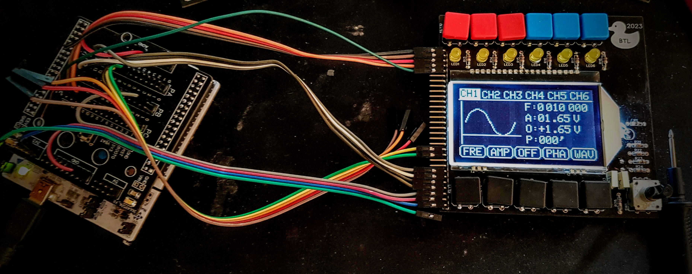

# Portable Signal Generator

## Description
The **Portable Signal Generator** is designed to be a versatile and compact tool for generating a wide range of electrical signals, suitable for testing and debugging electronic circuits. With six independent channels, this device offers flexible signal generation, including sine, square, triangle, and PWM waveforms. Each channel can be precisely configured for frequency, amplitude, phase, and duty cycle, making it a powerful instrument for engineers and hobbyists alike.

**Note:** This project is currently in development and not yet complete.

## Features
- **6 Independent Channels**:
  - Channels 1-3: Can generate sine, square, triangle, and PWM signals.
  - Channels 4-6: Can generate PWM signals.
- **Signal Parameters Control**:
  - Frequency: from 1 Hz to 1 MHz.
  - Amplitude: from 0 V to 5 V.
  - DC Offset: from 0 V to 5 V.
  - Phase shift: from 0 to 360 degrees.
  - PWM Duty cycle: from 0% to 100%.
- **Channel Synchronization**: Ability to synchronize two or more channels to modify their parameters simultaneously.
- **Battery Powered**: The device will be powered by a battery, ensuring mobility.

## Motivation

The main goal of this project is to create a tool that I currently lack in my home workshop. I aim to build the device using parts I already have or that are relatively inexpensive. For example, I have several AD9833 (Programmable Waveform Generator) chips available at home, which I used for generating sine, square, and triangle waveforms. 

Although the AD9833 can generate frequencies up to 12.5 MHz, I decided to limit the frequency range to 1 MHz. This decision stems from the difficulties I encountered while designing the circuit board — at higher frequencies, the signal became too distorted and attenuated. 

For the display, I used a COG display that I already had on hand. In the future, I may upgrade to a higher-resolution display with a touchscreen for better user interaction.

To control the DC offset of the output signal, I used the AD5313, a 10-bit DAC controlled via SPI.

The entire device is powered by an STM32G474 microcontroller. I chose this microcontroller for its integrated analog peripherals (ADC and DAC) and support for DSP functions, which are critical for this project.
